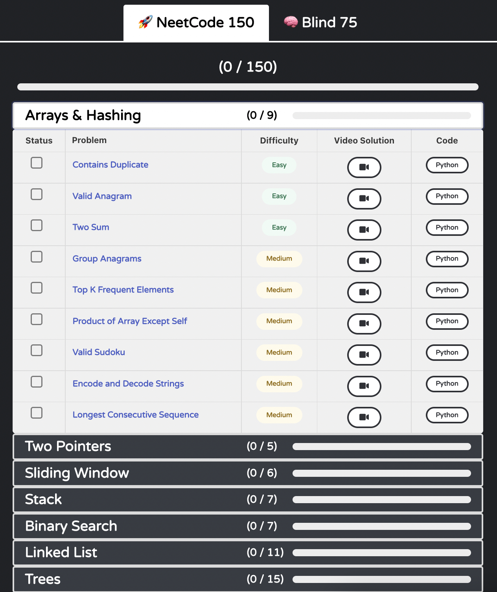

# Leetcode 风格面试

<star />

## 什么是 Leetcode 风格面试？

Leetcode 风格面试可能是软件工程师面试中最臭名昭著的一类。在这类面试中，你拿到一道算法 / 数据结构题，要么在白板上、要么在电脑上解出来。面试官会评估你的编码、批判性思维、沟通和问题解决能力。通常你还要主动表达你做出的决策与权衡，并讨论你方案的时间和空间复杂度。

虽然很多公司（尤其 big tech）会做 Leetcode 风格面试，但要意识到——**很多其他公司并不这样做**。[这个 GitHub 仓库](https://github.com/poteto/hiring-without-whiteboards)列出了一批不做 Leetcode 风格面试的公司。另外，如果你对某家公司感兴趣、想知道他们是不是 Leetcode 风格，可以查它们 [Glassdoor](https://glassdoor.com) 页面的面试版块。如果你**真的**讨厌算法/数据结构题，市面上有很多不要求你解这种题的好工作。

## 评估维度

碰到 Leetcode 题时，很容易慌"我必须找到最优解"。我的经验告诉我，**事实并非如此**。我有一次 FAANG 面试，4 道 Leetcode 题里我大概只有 1 道拿出了最优解，**仍然**拿到了 offer。

虽然不能**过度**泛化（公司差别很大），但你通常会在以下几个维度被评估：

- **Coding 能力**：你是否对控制流和逻辑掌握良好？写代码是否相对快速、格式是否清晰？变量命名是否合理？
- **算法 / 数据结构**：算法和数据结构选型是否合适？时间空间复杂度是否最优？你是否准确评估了复杂度？
- **沟通**：你是否解释清楚了你的工作？你是否问了 clarifying questions？是否谈到了 trade-offs？技术概念是否讲得明白？你是封闭还是粗鲁？
- **问题解决能力**：你是否花时间理解问题、问对的 clarifying questions？你是否给面试官一种"在新挑战面前会很严谨"的印象？

如你所见，算法/数据结构只是**其中一块**。至少对我来说这是一大解脱——当然你应该尽力给出最优解，但即使在算法上没那么强，把其他几个维度打磨好也能走得很远。

## 怎么准备 Leetcode 风格面试

我承诺这是一份有立场的指南，本节绝不会让你失望！

我的第一条建议：**买 [Leetcode](https://leetcode.com) 会员**。这是一条有争议的意见，但我真心觉得它新增的功能值这每月 $35。两个我最看重的好处是：

- Leetcode 官方提供的题解
- 公司 tag（按公司给题打标签，可按频次排序）

**注：** 如果每月 $35 会让你财务紧张，那就别买！同样的信息你也能免费拿到，只是要多花点时间去找。比如 YouTube 上有些不错的题解；公司相关的题也可以在 Leetcode 论坛里找到。

### 用 NeetCode 150

Leetcode 是一个上千题的大站，从哪开始？答案是 _NeetCode_。

[NeetCode](https://neetcode.io) 在 Leetcode 风格面试上**救了我的命**。NeetCode 整理了一份 150 题的精选 + 分类清单。除此之外，作者还给每一题录了**质量极高**的视频题解。

下图是 NeetCode 的界面截图：

我推荐用 NeetCode 150 的流程：

1. 在某个分类里把所有"easy"题目都做一遍。这帮你掌握这个分类背后基础的数据结构和算法。
2. 一个分类一个分类地往下走，重复同样过程。
3. 把所有"easy"做完之后，按相同流程做"medium"。这能检验你对核心数据结构和算法的留存度，难度会显著上升。
4. 最后，对"hard"重复一遍。这些大多会很难！

每做一题都尽量评估方案的时间和空间复杂度。[Big O Cheatsheet](https://www.bigocheatsheet.com/) 是一份很方便的复杂度参考表。

### 卡住的时候

每道题，我建议你先**自己**做至少 30 分钟。如果是 hard，做 45 分钟到 1 小时。

你**不可避免**会卡住。事实上，如果你刚开始刷 Leetcode，你会在 easy 上就卡住（我自己当时就是）。最帮我的是 NeetCode 每题配的讲解视频。它们做得很好，通常先白板讲清思路，再开始写代码。Leetcode 官方题解也是大杀器：通常先给一个"暴力解"，然后逐步演进到时间空间更优的方案。

理解思路之后，回到 Leetcode **不看视频**自己写一遍。这一步对我来说**极其重要**——看视频解和自己亲手写出来是完全不同的事。

### 能做完就尽量做完

如果可以，把 NeetCode 150 全部做完。我自己其实没做完——有些 hard 我从来没拿出过能跑的解。也无所谓！

### 公司 tag 题

Leetcode 用户可以上报某公司出过的题，Leetcode 把这些题按公司打 tag，并计算每家公司最常见的题。Leetcode Premium 会员能看到这些 tag。很多公司会主动避免再用泄露到 Leetcode 上的题；不过我还是觉得做这些 tag 题很有价值——它能让你**感受**这家公司的题型偏好。

我的建议是：进入目标公司的 tag 页面（前提是你已经知道要面试它了），按"frequency"排序，从最高频的开始做。

### 练习边做边讲

第一次会很别扭，但**强烈建议**你边做练习题边把脑子里的思路讲出来。你不会想把"第一次开口讲思路"留到面试现场。

### 用 Glassdoor

用 [Glassdoor](https://glassdoor.com) 看公司的面试页面。常常会有人写他们被问的题。你可能会发现某家公司专门偏向某一类 Leetcode 题（或者根本不考 Leetcode 风格的题）。

### 用你最熟的语言

关于 Leetcode 用什么语言最好，争论很多（提示：是 Python）。但其实，**用你最熟的就好**。我职业生涯多数时间偏 front-end，所以我用 JavaScript。如果你没有"最熟"的，那就用 Python（简洁、可读、内置数据结构好用）。

公司一般不会强制你必须用某种语言，但我**也**听说过这种情况。务必和 recruiter 确认你能不能用你想用的语言！

## 刷多少 Leetcode 才够？

这个问题非常难回答！我上一轮总共做了大约 220 题，面试很顺。话虽如此，有人做更少也面得很好，有人做更多反而不行。

有几条现实：

- **质量比数量更重要。** 如果你做了一堆题但每次都靠看答案，你其实没有真正培养问题解决能力。
- **面试有不少运气成分。** 多刷题能提高你成功的概率，但即便最熟练的人也有可能被难住。

实话说我从来没真正"觉得自己准备好了"，但我刷了几百题，就那么硬上了。

## 打磨你的软技能

我谈了很多怎么解 Leetcode 题，但 Leetcode 风格面试还有同等重要的另一面：你要让面试官事后心想"哇，我希望和这个人共事。"

我（自认为）在这方面做得还行，靠的是：

- **过度沟通（Over-communicate）**。你不说，面试官就不知道你在想什么。这在你**还没**找到解、正在权衡选项时尤其重要。
- **保持友好**。Leetcode 面试很有压力。压力下我们默认会变得不开心。面试官看过**太多**全程公事公办、闷头敲键盘的候选人。你只要笑一笑、聊几句，就能很大程度上脱颖而出。
- **用问题验证你的逻辑**。面试官多数情况下**希望你成功**——尤其当你看起来是个不错的人时。我在 Leetcode 风格面试里最爱问的一句是 **"does that make sense?"** 我会在我提出方案、讲完时间空间复杂度之后这么问。如果你判断对了，面试官常会说"嗯，听起来不错！"如果他想看到别的（比如你的逻辑有漏洞、效率不够），他往往会**告诉你**。这能极大避免你顺着错误方向继续走！

你不一定能控制自己拿到一道能给最优解的题，但你**一定能**控制自己面试中的态度和软技能。这可能就是拿不拿到 offer 的分水岭！

## 总结

本节较长，回顾一下：

1. 用 [NeetCode 150](https://neetcode.io/practice) 练习 Leetcode 风格题。先把所有 easy 做完，然后 medium，最后 hard。每题至少自己花 30–60 分钟尝试，再看 NeetCode 讲解视频。
2. 练习边做题边把思路讲出来。
3. 用 Leetcode 公司 tag 找目标公司最高频的题。
4. 用 [Glassdoor](https://glassdoor.com) 看公司的题型偏好。
5. **不要把视野只锁在"解出来"。** 同时确保你给人留下"是个好同事候选人"的印象。

<foot />
